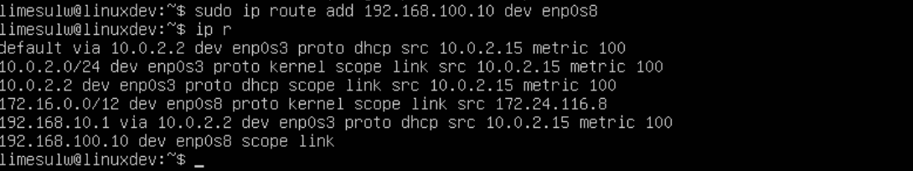
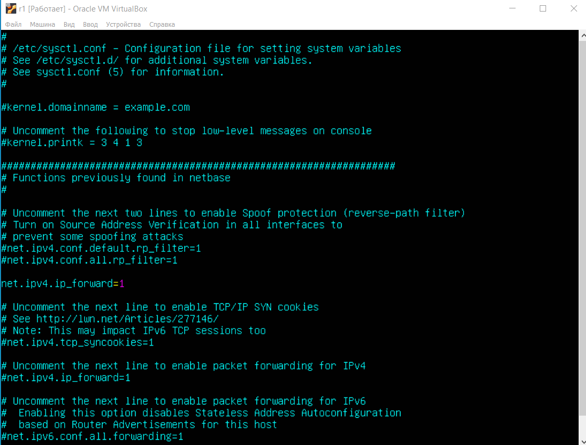
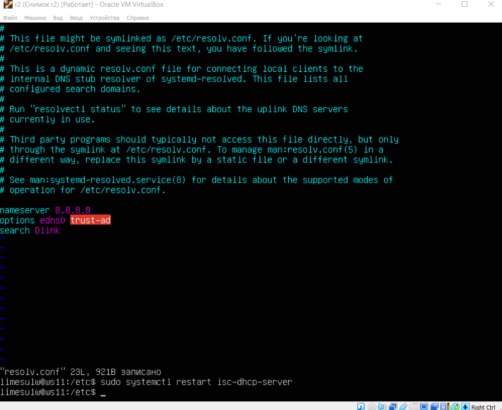
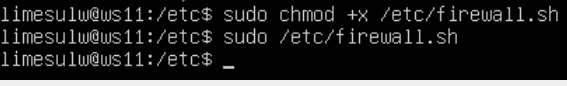
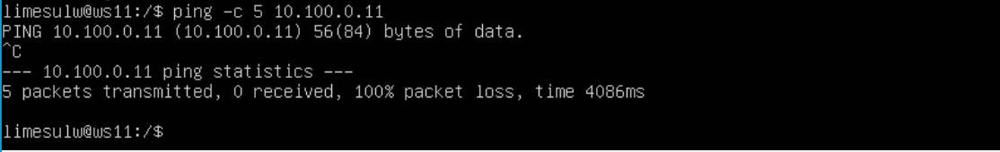

# Linux Network

## Part 1. **ipcalc** tool

#### 1.1. Networks and Masks
##### 1) 
##### 2) 
    255.255.255.0 :
    в префиксной: **/24**
    в двоичной: **11111111.11111111.11111111.00000000**
	

    /15 :
    в обычной: **255.254.0.0**
    в двоичной: **11111111.11111110.00000000.00000000**

    11111111.11111111.11111111.11110000:
    в нормальной: **255.255.255.240**
    в префиксной: **/28**

##### 3) Сеть 12.167.38.4 с масками:
	**/8**:
		min: **12.0.0.1**
		max: **12.255.255.254**

	**11111111.11111111.00000000.00000000**:
		min: **12.167.0.1**
		max: **12.167.255.254**

	**255.255.254.0**:
		min: **12.167.38.1**
		max: **12.167.39.254**

	**/4**:
		min: **0.0.0.1**
		max: **15.255.255.254**

#### 1.2. localhost
	Диапазон адрессов от **127.0.0.0 — 127.255.255.255**

	**194.34.23.100** не в диапазоне
	**127.0.0.2** в диапазоне
	**127.1.0.1** в диапазоне
	**128.0.0.1** не в диапазоне

#### 1.3. Network ranges and segments
#### 1)Диапазоны адресов зарезервированы для частных (также известных как LAN) сетей:
	10.0.0.0 — 10.255.255.255 ( 10.0.0.0/8 )
	172.16.0.0 — 172.31.255.255 ( 172.16.0.0/12 )
	192.168.0.0 — 192.168.255.255 ( 192.168.0.0/16 )

	10.0.0.45 - частный
	134.43.0.2 - публичный
	192.168.4.2 - частный
	172.20.250.4 - частный
	172.0.2.1 - публичный
	192.172.0.1 - публичный
	172.68.0.2 - публичный
	172.16.255.255 - частный
	10.10.10.10 - частный
	192.169.168.1 - публичный

#### 2)Диапазон сети 10.10.0.0/18 от **10.10.0.1 — 10.10.63.254**

	10.0.0.1 - не подходит
	10.10.0.2 - подходит
	10.10.10.10 - подходит
	10.10.100.1 - не подходит
	10.10.1.255 - подходит
## Part 2. Static routing between two machines

## Описание внутреннего сетевого интерфейса

## На ws1 и ws2 отключаем DHCP, меняем адрес и маску на соответсвующие в задании. Прописываем настройки адаптера enp0s8, добавляем его в настройках виртуальной машины с названием intnet (на обоих машинах).

- `netplan apply` команда для перезапуска сетевой службы

## Появился новый адаптер на двух машинах

#### 2.1. Добавление статического маршрута вручную

##### Пинг соединения между машинами

#### 2.2. Добавление статического маршрута вручную

##### Пинг соединения между машинами

## Part 3. **iperf3** утилита

#### 3.1. Скорость присоединения

- 8 Mbps - 1 MB/s (Мегабит/сек в Мегабайт/сек)
- 100 MB/s - 819200 Kbps, (Мегабайт/сек в Килобит/сек)
- 1 Gbps - 1024 Mbps (Гигабит/сек в Мегабит/сек)

#### 3.2. **iperf3** utility

## Part 4. Network firewall

#### 4.1. **iptables** утилита

#### На обеих машинах запускаем файл с помощью этой команды

#### Разница заключается в порядке команд, утилита iptables выполняет первое прочитанное правило, соответсвенно на ws1 будет выполнятся запрет(DROP) и пинг не пройдет, а на ws2 наоборот, первым стоит ACCEPT, значит разрешить прохождение пакета, пинг пройдет.

#### 4.2. **nmap** утилита

## Part 5. Static network routing

#### 5.1. Конфигурация адресов машин

#### ip -4 a

#### Пинг ws11 & r1

#### Пинг ws21 & ws22

#### 5.2. Включение IP-переадресации
##### Чтобы включить переадресацию IP, выполнил на двух маршрутизаторах следующую команду:
`sudo sysctl -w net.ipv4.ip_forward=1`.

##### Открыл */etc/sysctl.conf* файл на 2 маршутизаторах и добавил следующую строку:
`net.ipv4.ip_forward = 1`

#### 5.3. Установка маршрута по-умолчанию

##### Настроить маршрут по-умолчанию (шлюз) для рабочих станций. Для этого добавить `default` перед IP роутера в файле конфигураций

#### Также добавил шлюзы для роутеров, чтобы пинг доходил в соседнюю сеть.

##### Вызвать `ip r` и показать, что добавился маршрут в таблицу маршрутизации

##### Пропинговал с ws11 роутер r2 и показать на r2, что пинг доходит. Для этого использовать команду:
`sudo tcpdump -tn -i enp0s9`

#### 5.4. Adding static routes
##### Добавить в роутеры r1 и r2 статические маршруты в файле конфигураций.

##### Вызвать `ip r` и показать таблицы с маршрутами на обоих роутерах.

##### Запустить команды на ws11:
`ip r list 10.10.0.0/[маска сети` и `ip r list 0.0.0.0/0`

- Маршрутизация осуществляется по принципу наибольшего совпадения маски. У маршрута по-умолчанию приоритет намного ниже, поэтому этот маршрут будет срабатывать, когда нет другого подходящего маршрута в таблице маршрутизации.

#### 5.5. Построение списка маршрутизаторов

##### Запустить на r1 команду дампа:
`sudo tcpdump -tnv -i enp0s9`

##### При помощи утилиты traceroute построиl список маршрутизаторов на пути от ws11 до ws21
#### Установим утилиту traceroute командой `sudo apt install traceroute`

- Каждый пакет проходит на своем пути определенное количество узлов, пока достигнет своей цели. Количество узлов, которые может пройти пакет перед тем, как он будет уничтожен записывается в заголовке TTL. Каждый маршрутизатор, через который будет проходить пакет уменьшает его на единицу. При TTL=0 пакет уничтожается. Команда traceroute linux отправляет пакет с TTL=1 и смотрит адрес ответившего узла, дальше TTL=2, TTL=3 и так пока не достигнет цели. Каждый раз отправляется по три пакета и для каждого из них измеряется время прохождения. Пакет отправляется на случайный порт, который не занят. Когда утилита traceroute получает сообщение от целевого узла о том, что порт недоступен трассировка считается завершенной.

#### 5.6. Использование протокола **ICMP** при маршрутизации
##### Запустить на r1 перехват сетевого трафика, проходящего через eth0 с помощью команды:
`sudo tcpdump -n -i enp0s8 icmp`

##### Пропинговать с ws11 несуществующий IP (например, 10.30.0.111) с помощью команды:
`ping -c 1 10.30.0.111`

## Part 6. Dynamic IP configuration using **DHCP**

#### Для r2 настроить в файле /etc/dhcp/dhcpd.conf конфигурацию службы DHCP:
#### Для начала скачаем isc-dhcp-server командой `sudo apt install isc-dhcp-server`

##### 1) указать адрес маршрутизатора по-умолчанию, DNS-сервер и адрес внутренней сети

##### 2) в файле resolv.conf прописать nameserver 8.8.8.8.
#### Перезагрузить службу DHCP командой systemctl restart isc-dhcp-server. Машину ws21 перезагрузить при помощи reboot и через ip a показать, что она получила адрес. Также пропинговать ws22 с ws21.

##### Указать MAC адрес у ws11, для этого в etc/netplan/00-installer-config.yaml надо добавить строки: `macaddress: 10:10:10:10:10:BA`, `dhcp4: true`

##### Для r1 настроить аналогично r2, но сделать выдачу адресов с жесткой привязкой к MAC-адресу (ws11). Провести аналогичные тесты

##### Запросить с ws21 обновление ip адреса

`sudo dhclient -r enp0s8`
`sudo dhclient enp0s8`

## Part 7. **NAT**

##### В файле /etc/apache2/ports.conf на ws22 и r1 изменить строку Listen 80 на Listen 0.0.0.0:80, то есть сделать сервер Apache2 общедоступным

##### Запустить веб-сервер Apache командой service apache2 start на ws22 и r1

#### Добавить в фаервол, созданный по аналогии с фаерволом из Части 4, на r2 следующие правила:
#### 1) удаление правил в таблице filter - iptables -F
#### 2) удаление правил в таблице "NAT" - iptables -F -t nat
#### 3) отбрасывать все маршрутизируемые пакеты - iptables --policy FORWARD DROP

#### Запускать файл также, как в Части 4

##### Проверить соединение между ws22 и r1 командой ping

- При запуске файла с этими правилами, ws22 не должна "пинговаться" с r1

#### Добавить в файл ещё одно правило:
#### 4) разрешить маршрутизацию всех пакетов протокола ICMP
#### Запускать файл также, как в Части 4

#### Проверить соединение между ws22 и r1 командой ping
#### При запуске файла с этими правилами, ws22 должна "пинговаться" с r1

#### Добавить в файл ещё два правила:

#### 5) включить SNAT, а именно маскирование всех локальных ip из локальной сети, находящейся за r2 (по обозначениям из Части 5 - сеть 10.20.0.0)
#### Совет: стоит подумать о маршрутизации внутренних пакетов, а также внешних пакетов с установленным соединением

#### 6) включить DNAT на 8080 порт машины r2 и добавить к веб-серверу Apache, запущенному на ws22, доступ извне сети
#### Совет: стоит учесть, что при попытке подключения возникнет новое tcp-соединение, предназначенное ws22 и 80 порту

#### Перед тестированием рекомендуется отключить сетевой интерфейс NAT (его наличие можно проверить командой ip a) в VirtualBox, если он включен
#### Проверить соединение по TCP для SNAT, для этого с ws22 подключиться к серверу Apache на r1 командой:
`telnet [адрес] [порт]`

## Part 8. Bonus. Introduction to **SSH Tunnels**

#### Запустить на r2 фаервол с правилами из Части 7
#### Запустить веб-сервер Apache на ws22 только на localhost (то есть в файле /etc/apache2/ports.conf изменить строку Listen 80 на Listen localhost:80)

#### Воспользоваться Local TCP forwarding с ws21 до ws22, чтобы получить доступ к веб-серверу на ws22 с ws21

#### Воспользоваться Remote TCP forwarding c ws11 до ws22, чтобы получить доступ к веб-серверу на ws22 с ws11

#### Для проверки, сработало ли подключение в обоих предыдущих пунктах, перейдите во второй терминал (например, клавишами Alt + F2) и выполните команду:
`telnet 127.0.0.1 [локальный порт]`

  - `service apache2 start` - запуск сервера на ws22

  - `ssh -L 8080:10.20.0.20:80 limesulw@localhost` - доступ с ws21 к серверу на ws22

  - `ssh -R 8080:10.20.0.10:80 limesulw@localhost` - доступ с ws11 к серверу на ws22

  - `telnet 127.0.0.1 8080` - проверка подключения